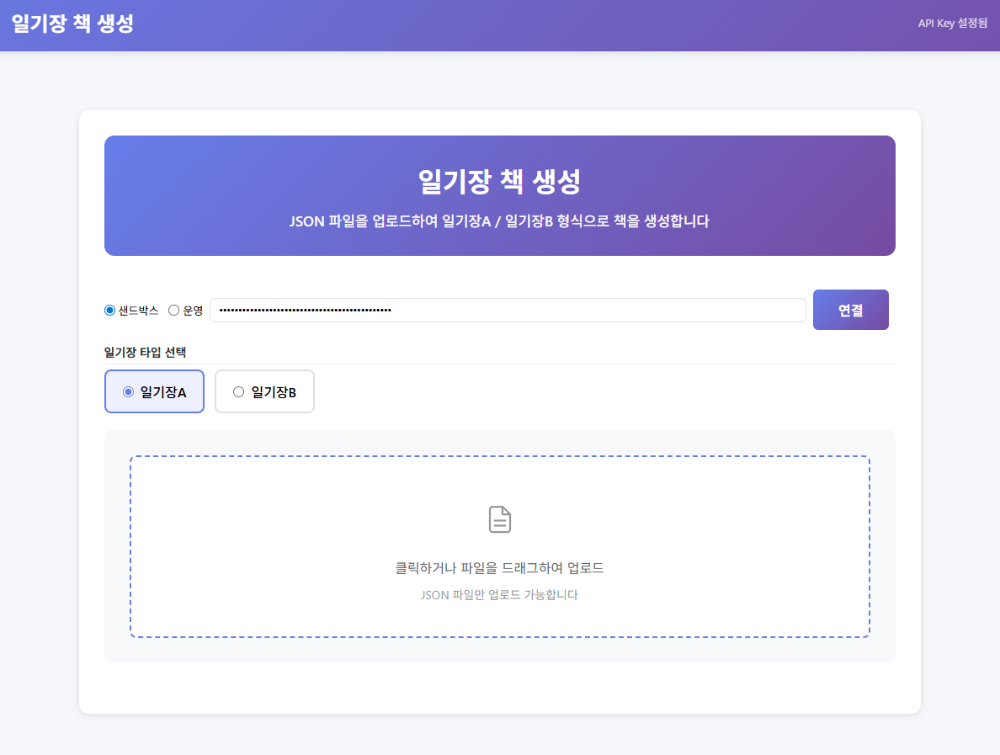

# diaryBook-demo — 일기장 책 생성

일기장 A / B 타입의 책을 생성하는 웹앱입니다. JSON 데이터를 업로드하여 일기장 포토북을 만들 수 있습니다.



> 이 demo는 **3-tier 구조**로 동작합니다. 브라우저는 Sweetbook API를 직접 부르지 않고,
> Sweetbook SDK와 API Key는 이 demo의 백엔드(`server.js`) 프로세스 안에만 존재합니다.

## 구조

```
 브라우저 (index.html, app.js, book-builder.js)
        │
        │  fetch('/api/...')            ← backend-client.js가 감싼 래퍼
        ▼
 이 demo 서버 (server.js, bookprintapi SDK 소유)
        │
        │  Sweetbook API Key (서버 env)
        ▼
 Sweetbook API
```

| 파일 | 역할 |
|---|---|
| `index.html`, `style.css` | 마크업 / 스타일 |
| `app.js` | UI 이벤트, 책 생성 플로우, 일시중지/이어서하기 |
| `book-builder.js` | entries 변환, 파라미터 빌더 |
| `backend-client.js` | 브라우저→백엔드 /api/* 얇은 래퍼 (SDK 아님) |
| `diary-config.js` | 템플릿 UID 매핑, 필드 정의 |
| `server.js` | **백엔드**. `bookprintapi` SDK로 Sweetbook 호출. /api/* 노출 |
| `.env` | 서버 전용 설정 (API Key, 환경). 브라우저로 안 내려감 |
| `일기장A/`, `일기장B/` | 템플릿 CSV + 샘플 JSON |

## 일기장 A vs B

| 항목 | 일기장A | 일기장B |
|------|---------|---------|
| 간지 | 월별 구분 (1월, 2월...) | 계절별 구분 (봄, 여름...) |
| 날짜 | `day_num` (일수만) | `date` (M.DD 형식) |
| 표지 | `coverPhoto` + `title` + `dateRange` | `frontPhoto` + `backPhoto` + `spineTitle` |

## 실행

### 1. 설정

```bash
cp .env.example .env
```

`.env`를 열어 값을 채우세요:

```ini
SWEETBOOK_ENV=sandbox
SWEETBOOK_API_KEY=sk_test_xxxxx
PORT=8080
```

### 2. 의존성 설치

```bash
npm install
```

SDK는 npm 레지스트리가 아니라 **GitHub 태그**에서 바로 설치됩니다 (`package.json` 참고).

### 3. 실행

```bash
npm start
```

접속: http://localhost:8080

## 백엔드가 노출하는 REST 엔드포인트

프론트의 `backend-client.js` 래퍼가 호출하는 좁은 API입니다.

| 메서드 | 경로 | 설명 |
|---|---|---|
| GET | `/api/env` | 서버 환경(sandbox/live) 반환. API Key는 내려주지 않음 |
| POST | `/api/books` | 책 생성 |
| POST | `/api/books/:uid/cover` | 표지 생성 |
| POST | `/api/books/:uid/contents` | 내지 1장 삽입 (간지/내지/갤러리 공통) |
| POST | `/api/books/:uid/finalize` | 책 최종화 |

## 스모크 테스트

서버 기동 후 최소 동작 확인:

```bash
npm start            # 터미널 1
npm run smoke        # 터미널 2 — sandbox에서만 동작
```

기대 출력:
```
✓ GET /api/env → 200
✓ env=sandbox
✓ POST /api/books → 200
✓ bookUid 발급: bk_xxx
스모크 통과.
```

## 사용법

1. 브라우저에서 http://localhost:8080 접속
2. 일기장 타입 선택 (A / B)
3. 샘플 JSON 파일 업로드:
   - `일기장A/samples/일기장A_이안.json` — 일기장A 샘플 (6개월, 54 entries)
   - `일기장B/samples/일기장B_이안.json` — 일기장B 샘플 (1년 4개월, 50 entries)
4. 표지/발행면 정보가 자동 입력됨 → 필요시 수정
5. **일기장 책 생성하기** 클릭

### JSON 데이터 형식

```json
{
  "title": "이안이의 하루 기록",
  "cover": {
    "coverPhoto": "https://...",
    "title": "이안이의 하루 기록",
    "dateRange": "24.01 - 24.06"
  },
  "publish": {
    "title": "이안이의 하루 기록",
    "publishDate": "2026년 3월 6일",
    "author": "김수진",
    "hashtags": "#포토북은 #역시 #스위트북"
  },
  "entries": [
    { "type": "ganji", "year": 2024, "month": 1, "chapter": 1 },
    { "type": "naeji_a", "day_num": "03", "diary_text": "새해 첫 산책...", "photo": "https://..." },
    { "type": "naeji_textonly", "day_num": "10", "diary_text": "비가 와서..." },
    { "type": "naeji_gallery", "day_num": "17", "photos": ["https://...", "https://..."] }
  ]
}
```

**entry 타입:**
| type | 설명 | 필수 필드 |
|------|------|-----------|
| `ganji` | 월/계절 구분 페이지 | `year`, `month`, `chapter` |
| `naeji_a` | 사진 + 글 | `day_num`, `diary_text`, `photo` |
| `naeji_textonly` | 글만 | `day_num`, `diary_text` |
| `naeji_gallery` | 사진 여러 장 | `day_num`, `photos` |

## 커스터마이징

| 파일 | 수정 내용 |
|------|----------|
| `diary-config.js` | 템플릿 UID 변경, 필드 정의 추가/수정 |
| `book-builder.js` | entries 변환 로직 수정 (자신의 데이터 형식에 맞게) |
| `app.js` | UI 흐름 변경, 폼 필드 추가/제거 |
| `server.js` | 새 백엔드 엔드포인트 추가 |
| `.env` | API 키, 환경 설정 |

## 관련 레포

- [sweet-book/bookprintapi-nodejs-sdk](https://github.com/sweet-book/bookprintapi-nodejs-sdk) — 이 demo의 `server.js`가 사용하는 SDK
